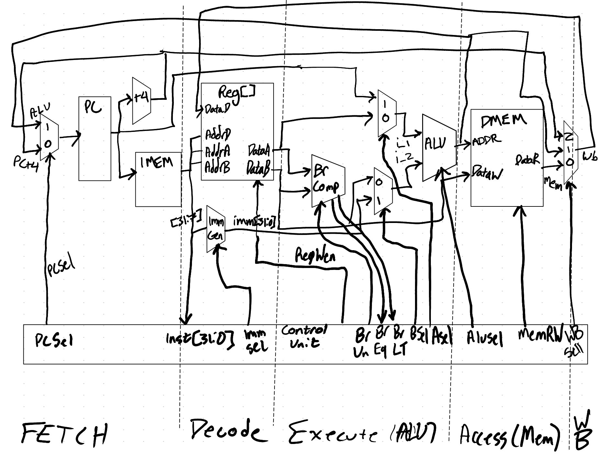

# rv32_processor

<h3>Datapath Pipeline </h3> 

Right Now IMEM is a 4Kb Instruction Cache.  No method of fetching from main memory or dynamic cache transfer  
To be added later  
<h3>Risc V RV32I Instruction Format </h3> 
<h4> Instruction Variants </h4>  
Type R, I, S, B, U, J  
(Image from RV32I Specification Section 2.3: https://riscv.org/wp-content/uploads/2019/06/riscv-spec.pdf)  

<h4> Immediate Construction Format </h4> 
Important to the Immediate Generator located in immGen/immGen.v  

Control Unit  
pc_sel Signal   

